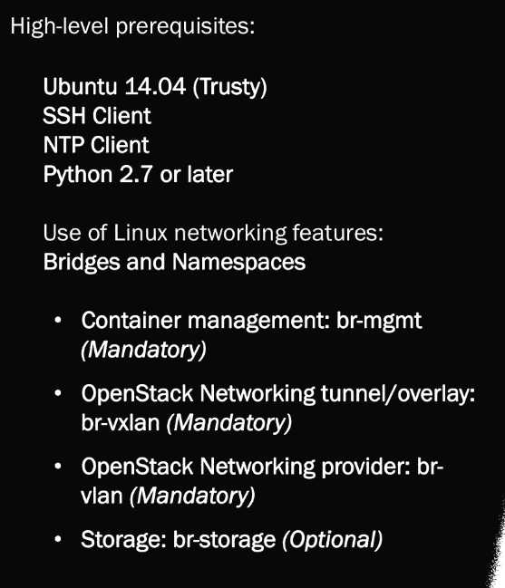
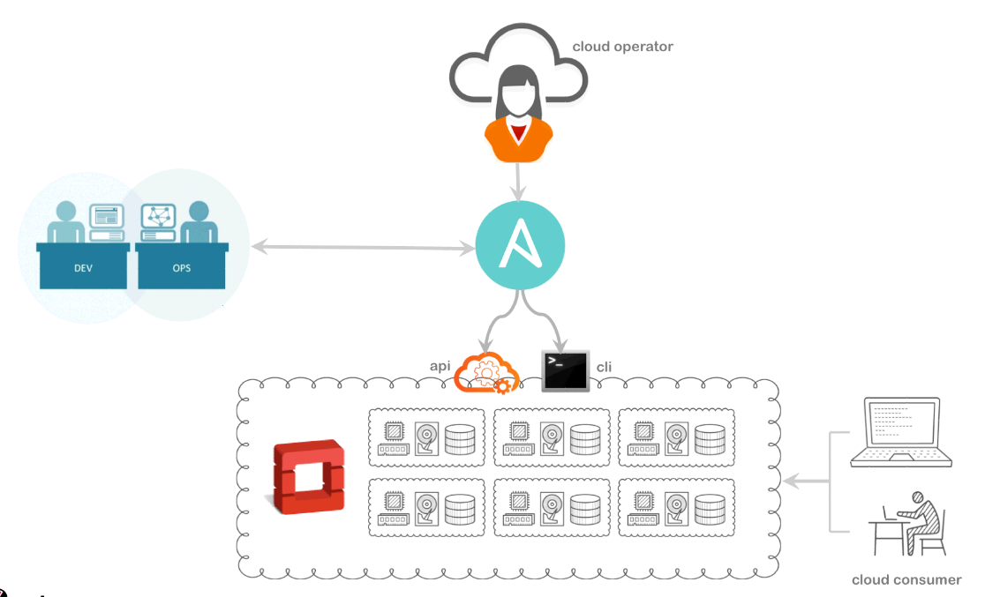
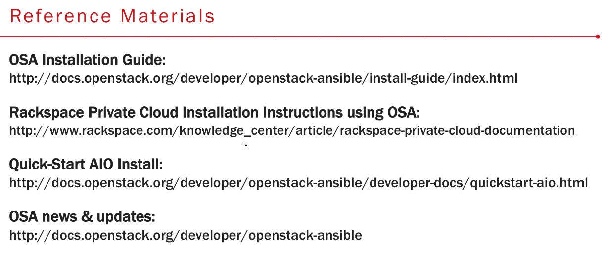

# OSA 101
<https://github.com/wbentley15/os-summit-wkshop-tokyo>
## OS Requirements

* Ubuntu 14
* NTP
* SSH
* Python



## Basic idea



## Networking Requirements
### Bridges and Namespaces
Required networks

* br-mgmt
* br-vxlan
* br-vlan
* br-storage

## Deploy OSA
### Playbooks to Run
* `setup-hosts.yml`
* `haproxy-install.yml`
* `setup-intrastructure.yml`
* `setup-openstack.yml`

OR

* `setup-everything.yml`

<https://github.com/openstack/openstack-ansible/tree/12.0.0/playbooks>

### Dependencies
* `openstack_environment.yml`
* `openstack_user_config.yml`
* `user_secrets.yml`
* `user_variables.yml`

## Operating OSA
### Requirements (Why Ansible)
* No client/agents
* Exising modules for mgmt and OS
* Playbooks can be written against API's or Python CLI's
* Designing roles with unique variable values is as easy as writing an email

## Scenario 1
Un-branded responsive website templates

* Doing via Horizon (one option)
* On Deployment node
* Run Playbook to generate users and passwords (shown in ansible playbook run): <https://github.com/wbentley15/os-summit-wkshop-tokyo/blob/master/operate-cloud/base.yml>

	```
	ansible-playbook -i hosts base.yml
	```
	
* Manually assigned user as "Admin" role
* Edited file in `group_vars` (coming back)

## Scenario 2 (Quota)
Turned your cloud into community public cloud 

3 devs need 30vCPU and 30 instances and the rest only need 20vCPU and 20 instances

* Go into Horizon, Manage members, and update quota.
* Use PB instead: <https://github.com/wbentley15/os-summit-wkshop-tokyo/blob/master/operate-cloud/roles/adjust-quotas/tasks/main.yml>

	```
	roles/adjust-quota
	
	qoptions: ['--cores 30',...
	tenantname: ['MRK-proj...
	
	ansible-playbook -i hosts quota-update.yml
	
	```
	
* You should notice that quota was updated.

## Scenario 3
Decided to fire all contractors, and you need to backup everything

* Delete all tenants
* Take snapshots of all tenants, projects, etc.
* Must be done manually through `Horizon`.
* Or can be done via Ansible, manually, one at a time via `extra-vars`: <https://github.com/wbentley15/os-summit-wkshop-tokyo/blob/master/operate-cloud/destroy-env.yml>

	```
	ansible-playbook -i hosts destroy-env.yml --extra-vars "tenant-name=MRKT-Proj01 userid=mrkt-dev01"
	```
	
* Verify manually through `Horizon`
	* Should see missing tenant
	* And extra snapshots of instances in glance

## Tips and Tricks
* Deploy using "tags" version of GitHub repo
* Check GitHub repo for new versions and variables being introduced
	* Presenter said to use a couple of versions behind for stability.
* Triple check your network setup
* Re-deployment steps (aka the clean-up process)
	* MUST DO THIS!!!
	* It will not allow a re-deployment to work correctly if this is not done.
* Galera health check playbook
	* Uses MariaDB for cluster
	* One node can fall of or go out of sync
* Running playbook with `-l` or `--limit`
	* Limit to specific host, just to ensure that only the host you intend to run against is the one deployed to.

## Reference Materials (Links)

Email: walter.bently@rackspace.com



## Q/A
* Common issues
	* Networking
	* Carefully verify networking.
* Ansible
	* What version (1.9).  Will move to 2.0 soon.  Huge amount of functionality added
	* Do not use OpenStack Modules
		* Modules are not up to date and not very useful
* Common issues operating OS Cloud
	* `nova` issues are common, which can be caused by issues with:
		* `neutron`
		* `keystone`
	* Watching Galera and RabbitMQ
* Any good tools to deploy bare-metal Ubuntu hosts?
	* MaaS (Works well for small cluster of servers)
		* Make sure you update to newest version of repository (Probably 1.8)
	* Cobbler
		* James Thorn? Has lots of tools

## Offline
* <https://www.packtpub.com/virtualization-and-cloud/openstack-administration-ansible>
* Contact:
	* @djstayflypro on Twitter
	* walter.bentley@rackspace.com